#Vasicsek Gábor IOP8IZ

###Dokumentáció

###Tantárgyak felvétele (mini Neptun)

##Követelményanalízis

###Funkcionális követelmények

- Vendégként a tantárgyak a főoldalon megtekinthetőek.
- Vendégként a tantárgyak szabadon böngészhetőek.
- Vendégként a tantárgyak adatai megtekinthetőek.
- Vendégként a tantárgyak kereshetőek.
- Vendégként van lehetőség regisztrációra.
- Felhasználóként van lehetőség belépni az oldalra.
- Felhasználóként van lehetőség saját adatok módosítására.
- Felhasználóként van lehetőség új tantárgy felvételére.
- Felhasználóként van lehetőség tantárgyak módosítására, törlésére.

###Nem funkcionális követelmények

- Felhasználóbarát, ergonomikus elrendezés és kinézet.
- Gyors működés.
- Biztonságos működés: jelszavak tárolása, funkciókhoz való hozzáférés.

###Szerepkörök

- Vendég: Tantárgyak keresését, böngészését és megtekintését végezheti.
- Felhasználó: A vendég szerepkörén túl a saját tantárgyainak kezelésére (új, módosít, törlés) képes.

###Használati esetek

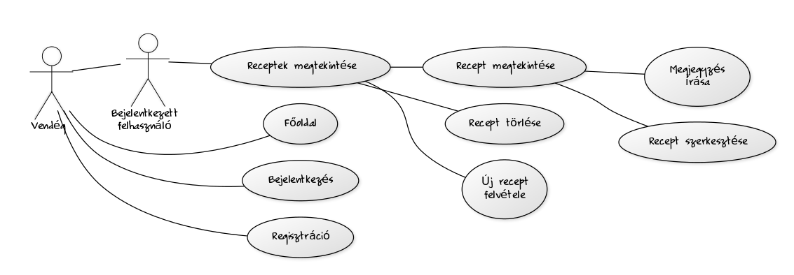

##Tervezés

###Oldaltérkép

Publikus:

- Főoldal
- Tantárgyak böngészése
    + Tantárgy megtekintése
- Belépés
- Regisztráció

Felhasználó

- Kilépés
- Profiladatok
    + Profiladatok szerkesztése
- Új tantárgy felvitele

###Végpontok

- GET/: főoldal
- GET/login: bejelentkező oldal
- POST/login: bejelentkezési adatok felküldése
- GET/register: regisztráció oldal
- POST/register: regisztrációs adatok felküldése
- GET/logout: kijelentkező oldal
- GET/ownSubjects: saját tantárgyak listázása
- GET/subjects/create: új tantárgy felvitele, űrlap megjelnítése
- POST/subjects/create: új tantárgy felvitele, adatok küldése
- GET/subjects/:id: tantárgy megtekintése
- GET/subjects/:id/edit: tantárgy módosítása
- POST/subjects/:id/edit: tantárgy módosítása, adatok küldése
- GET/subjects/:id/delete: tantárgy törlése
- GET/users/list: felhasználók listázása
- GET/users/:id: felhasználó megtekintése
- GET/users/:id/delete: felhasználó törlése
- GET/users/:id/edit: felhasználó módosítása
- POST/users/:id/edit: felhasználó módosítása, adatok küldése
- GET/search: keresés

###Oldalvázlatok

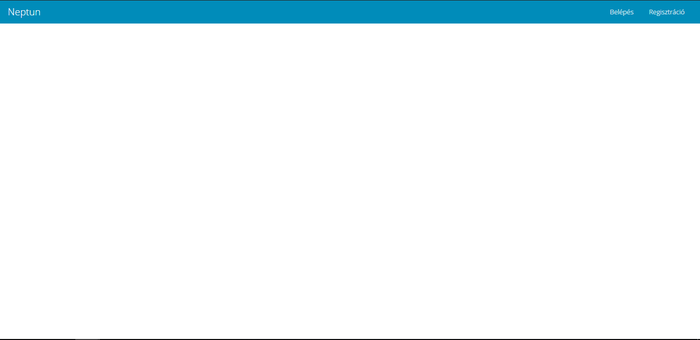
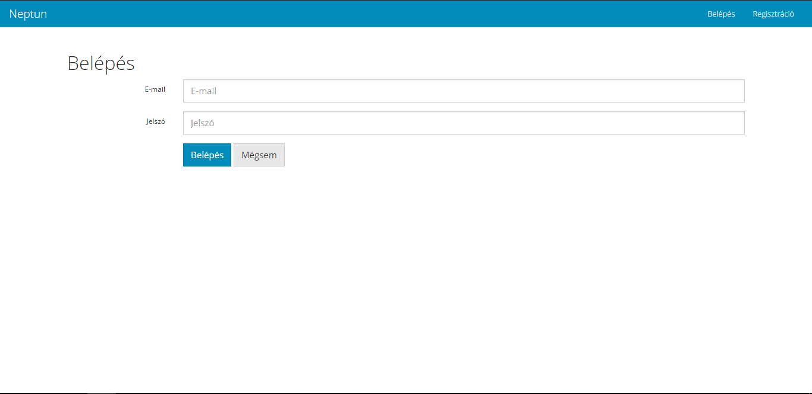
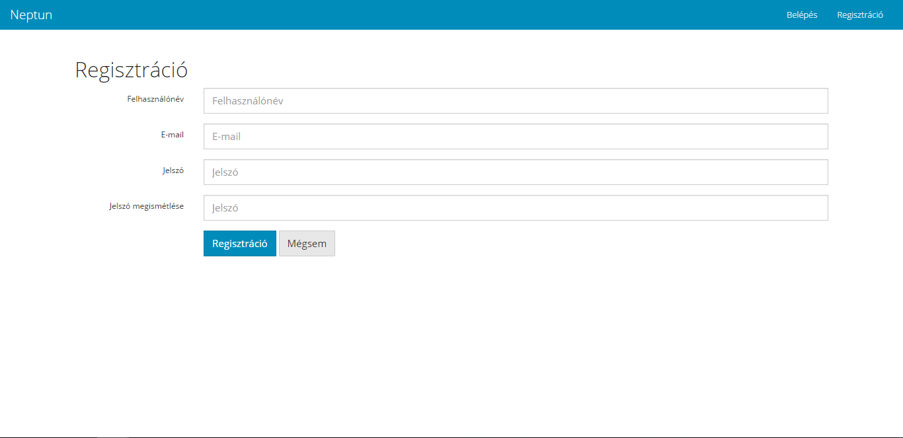
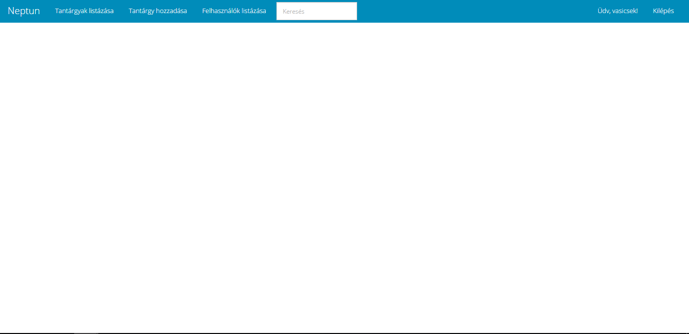
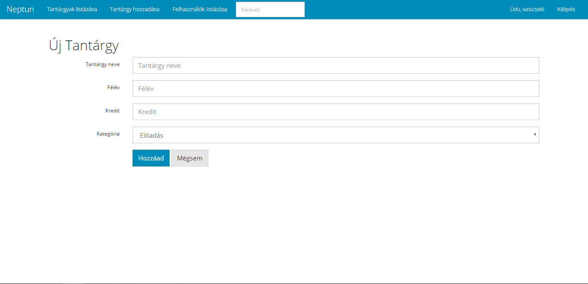
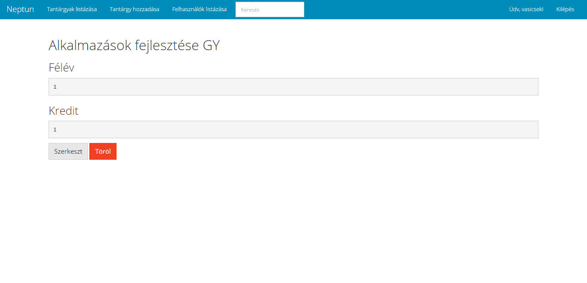
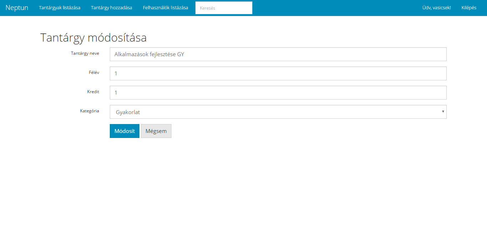
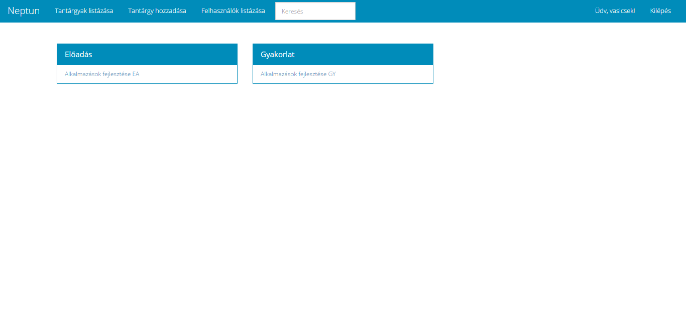
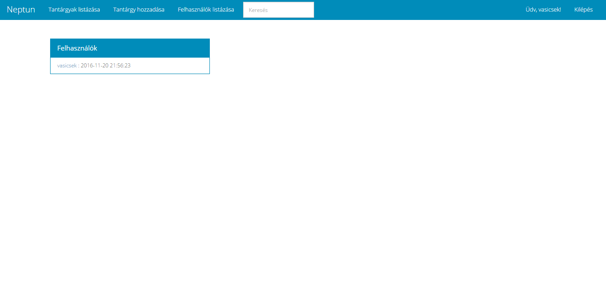
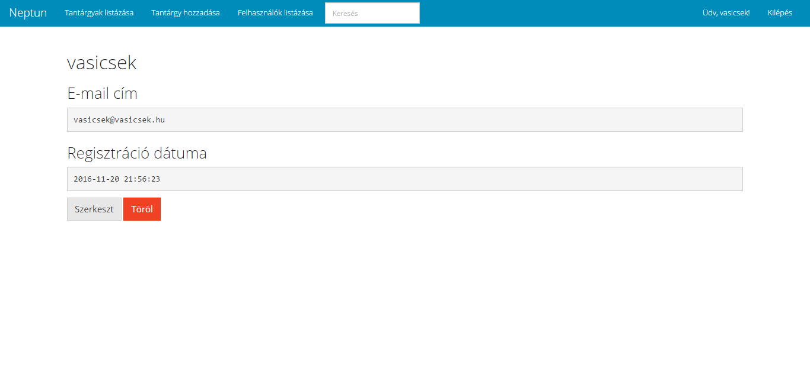
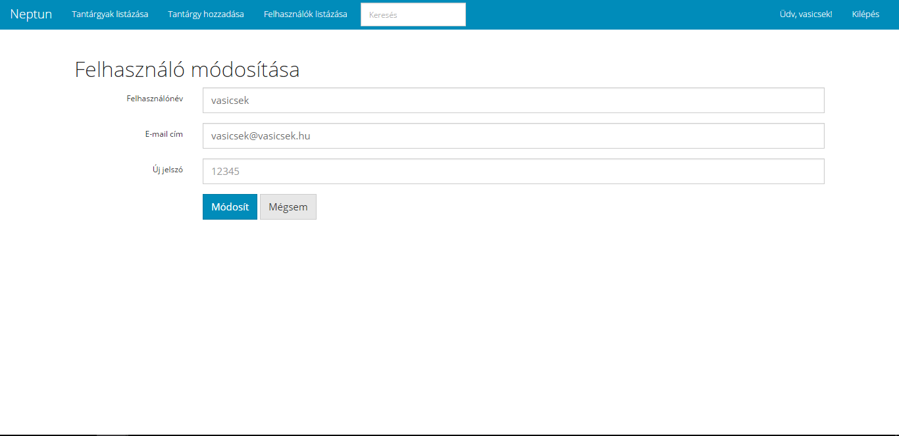

###Adatmodell

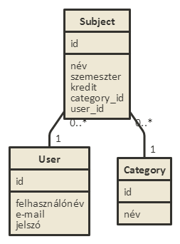

##Implementáció

###Fejlesztői környezet

- Visual Studio Code
- Node.js
- Adonis.js
- Git + Github

###Könyvtárstruktúra

##Felhasználói dokumentáció

###A futtatáshoz ajánlott hardver-, szoftver konfiguráció

- Futtatáshoz szükséges operációs rendszer: Tetszőleges operációs rendszer
- A futtatáshoz szükséges hardver: Operációs rendszerek szerint megadva
- Egyéb követelmények: Internet böngésző telepítése, JavaScript ajánlott

###Telepítés lépései

- Terminál nyitása -> git clone https://github.com/vasicsek/alkfejl.git -> cd neptun -> npm run dev

###A program használata

- Kattintsunk a Bejelentkezés vagy Regisztráció gombra
- Bejelentkezés vagy Regisztráció után a főoldalra jutunk ahol az összes tantárgy megjelenik
- Saját új tantárgy hozzáadásához kattintsunk a Tantárgy hozzáadása gombra
- Az adatok kitöltése után kattintsunk a Hozzáad gombra (hibásan kitöltött űrlap esetén a program hibát jelez)
- A saját tantárgyainkat a Tantárgyak listázása gombra kattintva érjük el (Admin user minden tantárgyat lát)
- Saját tantárgy szerkesztéséhez kattintsunk a tantárgy nevére, majd a Szerkeszt gombra (csk saját tantárgyat lehet szerkeszteni vagy törölni, kivéve admin user)
- Felhasználói adatok módosításához kattintsunk az Adataim módosítása gombra (admin user Felhaszhnálók módosítása gombot lát, ahol az összes felhasználó adatait múódosíthatja vagy törölheti a felhasználót)
- Az adatok szerkesztése után kattintsunk a Módosít gombra
- Kereséshez gépeljük meg a tantárgy nevét (nem kell a teljes név, de nagybetűkre és kisbetűkre figyelni kell)
- Ezután megjelenik a szűrt tantárgyak listája (üres kategória nem jelenik meg)
- Kijelentkezéshez kattintsunk a Kilépés gombra

##Harmadik beadandó

###Funkciók

- Törlés előtt egy felugró ablak jelenik meg, ahol lehetőségünk van megerősíteni vagy elvetni a Törlést új/módosított fájlok:
    - delete.js
    - subjectShow.njk
    - userShow.njk
- (AJAX) Bejelentkezésre kattintva egy felugró ablak jelenik meg (kikapcsolt javascript mellett a login oldalra ugrunk)
    - login_popup.js
    - main.njk
    - login.njk
    - UserController.njk
    - routes.js
- (AJAX) Regisztrációra kattintva egy felugró ablak jelenik meg (kikapcsolt javascript mellett a register oldara urgunk)
    - register_popup.js
    - main.njk
    - register.njk
    - UserController.njk
    - routes.js
- (AJAX) Tantárgy hozzáadása gombra kattintva egy felugró ablak jelenik meg (kikapcsolt javascript mellett a subjects/create oldalra ugrunk)
    - subject_add.js
    - SubjectController.njk
    - routes.js
- Regisztrációnál és új tantárgy felvételénél és módosításánál ellenőrzést végzünk és a hibásan kitöltött mezők esetén visszajelzést küldünk a felhasználónak
    - register.njk
    - subjectCreate.njk
    - subjectEdit.njk

####Tesztelés

Firefox böngészőhöz telepítjük a Selenium IDE kiegészítőt. Telepítés után elindítjuk a kiegészítőt, megnyitjuk a test mappában lévő teszteseteket, ezután a második zöld nyilra kattintva futtathatóak az előre elkészített tesztesetek.

- User test: Program teljes körü tesztelése, új felhasználó regisztrálása, tantárgy felvétele, tantárgy módosítása, tantárgy törlése, adatok módosítása, kijelentkezés
- Admin test: Admin funkciók tesztelése, bejelentkezés admin felhasználóval, felhasználók listázása, felhasználó adatainak módosítása, felhasználó térlése, kijelentkezés