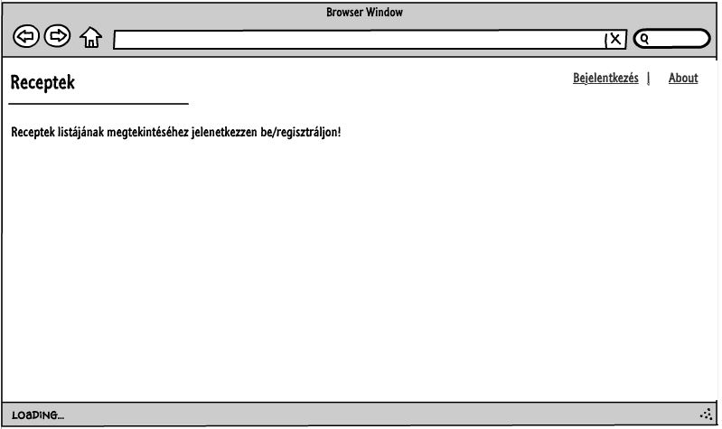
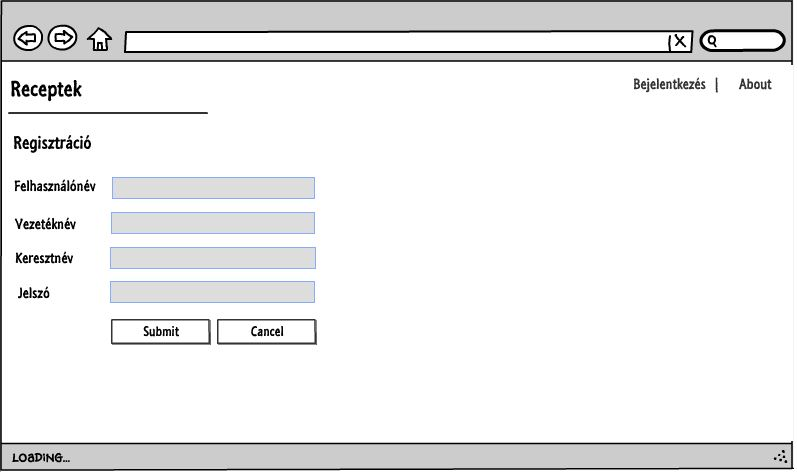
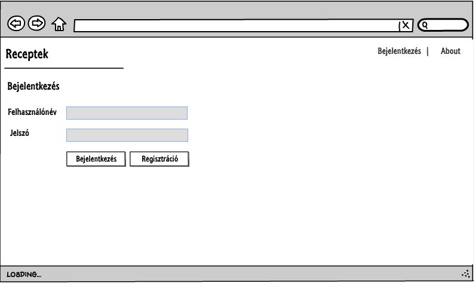
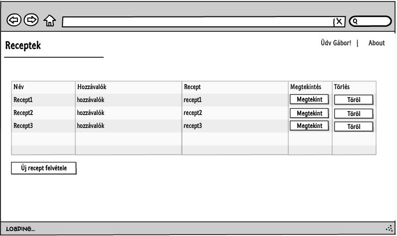
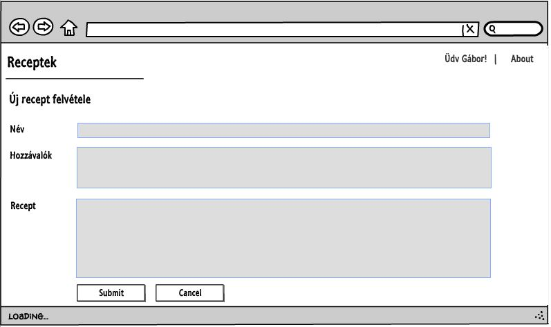
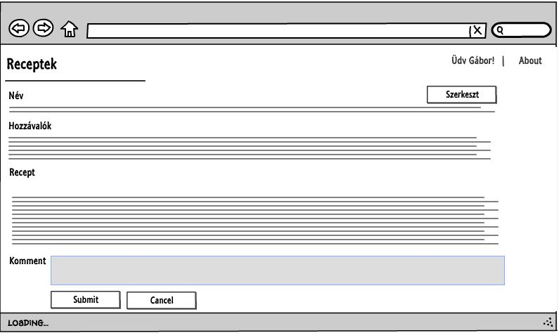
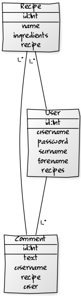
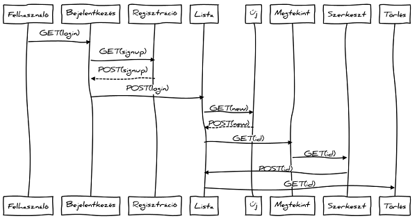

#Vasicsek Gábor IOP8IZ

###Dokumentáció

###Recept

##1.	Követelményanalízis
###1.1. Célkitűzés, projektindító dokumentum
Az alkalmazás fő feladata receptek, azok elkészítésének módja és hozzávalók jól átlátható megjelenítése. Az adatok védelmének érdekében legyen lehetőség regisztrációra, majd bejelentkezésre. A bejelentkezett felhasználó a receptek listáját megtekintheti, bővítheti, meglévő recepteket módosíthatja, törölheti, kommenteket írhat hozzájuk.

###1.2. Funkcionális követelmények
- Kellően megbízható (biztonsági szempontból) és stabil szerveroldal - Backend
- Az oldal fő funkciójához csak regiszrtált felhasználók férhetnek hozzá.
- Csak bejelentkezett felhasználók által elérhető funkciók
  - új recept felvétele
  - meglévő recept megtekintése
  - meglévő recept szerkesztése
  - meglévő recept törlése
  - komment írása

###1.3. Nem funkcionális követelmények
- Az általános JavaScript konvencióknak való megfelelés.
- Az általános UX/UI-nak való megfelelés.
- Könnyű áttekinthetőség, ésszerű elrendezés, könnyen kezelhetőség.
- Jelszóval védett funkciók, és a jelszavak védelme a háttérben. Hibásan bevitt adatok esetén a program jól láthatóan jelezzen a felhasználónak, és emelje ki a hibás beviteli mezőket. A jól bevitt adatok maradjanak az űrlapban.
- Könnyen lehessen bővíteni, a különböző típusú fájlok külön csoportosítva, ésszerűen legyenek felbontva, a könnyebb fejleszthetőség miatt.

###1.4. Használatieset-modell
Vendég: Csak a publikus oldalakat éri el

-	Főoldal
-	Bejelentkezés
-	Regisztráció

Bejelentkezett felhasználó: A publikus oldalak elérésén felül egyéb funkciókhoz is hozzáfér.

-	Új recept felvétele
-	Meglévő recept megtekintése
-	Meglévő recept szerkesztése
-	Meglévő recept törlése
-	Komment írása

###1.5. Szakterületi fogalomjegyzék
recept: étel elkészítéséhez szükséges hozzávalók és az elkészítés lépéseit tartalmazó leírás

ek: evőkanál

kk: kávéskanál

tk: teáskanál

csipet: 1 gramm

##2. Tervezés

###2.1.	Architektúra terv

####2.1.1. Komponensdiagram

####2.1.2. Oldaltérkép:

**Publikus:**

Főoldal

Bejelentkezés

Regisztráció

**Bejelentkezett:**

Főoldal

Új recept felvétele

Listaoldal

    Recept megtekintése
  
    Recept törlése
  
      Recept szerkesztése
    
      Megjegyzés hozzáfűzése

####2.1.3. Végpontok

- GET/: főoldal
- GET/login: bejelentkező oldal
- POST/login: bejelentkező adatok felküldése
- GET/login/signup: regisztrációs oldal
- POST/login/signup: regisztrációs adatok felküldése
- GET/logout: kijelentkező oldal
- GET/recipes/list: receptlista oldal
- GET/recipes/new: új recept felvétele
- POST/recipes/new: új recept felvételéhez szükséges adatok felküldése
- GET/recipes/id: recept adatok
- POST/recipes/id: új megjegyzés felvitele
- GET/recipes/delete=id: recept törlése
- GET/recipes/edit=id: recept módosítása
- POST/recipes/edit=id: recept módosítása, adatok felküldése

###2.2. Felhasználói-felület modell

####2.2.1.Oldalvázlatok:

Főoldal

Regisztrációs oldal

Bejelentkező oldal

Koktél listaoldal

Új koktél felvétele

Koktél megtekintése

Koktél szerkesztése

####2.2.2. Osztálymodell
 
Adatmodell

 
Adatbázisterv

####2.2.3. Dinamikus működés

Szekvenciadiagram

